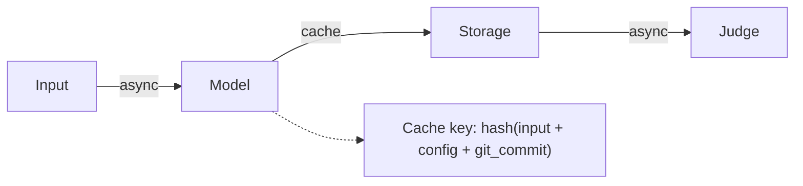

# LMMs-Eval v0.6

## Overview

After developing LMMs-Eval for over a year, we've integrated 100+ tasks and 30+ models across images, videos, and audio. Throughout this journey, we've grown increasingly aware that **evaluation itself deserves the same rigor we demand from the models we evaluate**. A benchmark that cannot reliably indicate a model's true capabilities is not just unhelpful, it actively misleads research directions.

This realization drives v0.6: a re-architecture designed to make evaluation **fast enough to iterate**, **rigorous enough to trust**, and **challenging enough to matter**.

Building on lmms-eval's existing framework, v0.6 transforms evaluation from a one-off script into a **production-ready evaluation system**. This enables two critical workflows:

- **During training**: Evaluation runs as a standalone service, decoupled from the training loop. Submit checkpoints for async evaluation without blocking GPU training.
- **Post-training**: Rapid, comprehensive evaluation across all modalities with statistical guarantees on the results.

From the engineering side, v0.6 also ships a substantial API-throughput upgrade. With the latest API control-path updates (adaptive concurrency, refill scheduling, prefix-aware queueing, and retry/backoff decoupling), we observe about **7.5x throughput improvement** on a fixed `LIMIT=100` benchmark (`0.3278 -> 2.4584 req/s`), while preserving metric outputs for the same task/model setup.

| Area | Key Features |
|------|--------------|
| **Performance** | Fully async and decoupled inference; adaptive API concurrency control; prefix-aware queueing; measured ~7x+ throughput gain on API benchmark path |
| **Evaluation as a Service** | Async job submission without blocking GPU training; separately hosted eval service on dedicated GPUs |
| **Statistical Rigor** | Confidence intervals, clustered standard errors, baseline-anchored paired comparison |
| **Frontier Evaluation** | Long video, spatial intelligence, and agentic scenarios |

---

## 1. Architecture

### 1.1 Evaluation Pipeline

v0.6 defines evaluation as three decoupled components:

```
┌─────────┐      ┌─────────┐      ┌─────────┐
│  Input  │ ───► │  Model  │ ───► │  Judge  │
└─────────┘      └─────────┘      └─────────┘
```

| Component | Contents | Output |
|-----------|----------|--------|
| **Input** | Multimodal data + question + ground truth | `Instance` objects |
| **Model** | LMM inference (local or API) | Generated responses |
| **Judge** | Metric computation (exact match, LLM judge, etc.) | Scores |

#### Async Pipeline with Cache

Both stages run asynchronously with intelligent caching:



**Cache System**

Avoid redundant inference when the same evaluation has been run before:

| Cache Key Component | Purpose |
|---------------------|---------|
| Input hash | Same dataset + question |
| Config hash | Same generation parameters (temp, max_tokens, etc.) |
| Git commit | Same model code version |

Cache hit -> skip inference, reuse stored outputs. Cache miss -> run inference, store results.

**Benefits**:
- No redundant computation: identical runs return cached results instantly
- Crash recovery: resume from cached outputs without re-inference
- Resource separation: Model (GPU) and Judge (API) can run on different machines
- Reproducibility: cache key ensures exact same conditions

#### Stage 1: Input -> Model

**Prefix Cache Optimization**

vLLM/SGLang reuse KV cache for shared prefixes. We cluster inputs by media to maximize hits:

- Prefix clustering: Group questions by shared image/video
- Length sorting: Similar lengths in same batch
- Chunked prefill: Split long prompts into chunks to reduce TTFT and avoid OOM

#### Stage 2: Model -> Judge

**Persist-First Strategy**: Save model outputs to disk immediately, then score asynchronously.

### 1.2 Model Interface & Backends

#### Decoupled Design

v0.6 separates evaluation logic from model inference. Models implement a standardized `LMM` abstract base class:

```python
class LMM(ABC):
    def generate_until(self, requests: list[Instance]) -> list[str]:
        """Batched text generation."""
        pass

    def loglikelihood(self, requests: list[Instance]) -> list[float]:
        """Token-level log probabilities for multiple-choice ranking."""
        pass
```

The `Instance` object carries:
- `media_list`: Raw images, video paths, or audio buffers
- `prompt`: Text prompt
- `gen_kwargs`: Generation parameters

#### Supported Backends

| Backend | Example |
|---------|---------|
| vLLM | `python -m lmms_eval --model vllm --model_args pretrained=Qwen/Qwen2.5-VL-7B` |
| SGLang | `python -m lmms_eval --model sglang --model_args pretrained=Qwen/Qwen2.5-VL-7B` |
| API Models | OpenAI, Anthropic, Groq, etc. - see [API Concurrency & Throughput](#13-api-concurrency--throughput) |

**Unified API Model Interfaces**

v0.6 unifies API-backed model evaluation under two interfaces:

| Interface | `--model` name | Backend | Recommended |
|-----------|---------------|---------|-------------|
| Async | `async_openai` | `asyncio` + `AsyncOpenAI` | **Yes** |
| Sync | `openai` | `ThreadPoolExecutor` + `OpenAI` | Fallback |

We recommend `async_openai` for all API-backed evaluation — it uses native async I/O and achieves significantly higher throughput.

Both resolve to **chat mode by default** via Model Registry V2. The simple mode (`doc_to_visual` + `doc_to_text`) is deprecated and will be removed in a future release.

> **Naming change in v0.6**: the canonical model names have been shortened from `openai_compatible` / `async_openai_compatible` to `openai` / `async_openai`. These are the names used in filenames, registry keys, and `@register_model` decorators. The old names (`openai_compatible`, `openai_compatible_chat`, `async_openai_compatible`, `async_openai_compatible_chat`) continue to work as aliases via `MODEL_ALIASES` in `__init__.py`, so existing scripts are not affected.

#### Model Registry V2

v0.6 introduces `ModelRegistryV2` — a unified model registry that replaces the previous ad-hoc import system. All model names (`--model X`) resolve through a single path.

**How it works**

Two dicts in `lmms_eval/models/__init__.py` declare available models:

- `AVAILABLE_SIMPLE_MODELS`: maps `model_id` -> `ClassName` for simple (legacy) models in `models/simple/`
- `AVAILABLE_CHAT_TEMPLATE_MODELS`: maps `model_id` -> `ClassName` for chat models in `models/chat/`

At startup, the registry merges both dicts into `ModelManifest` objects. Each manifest holds a `model_id` and up to two class paths (simple + chat). Class paths are auto-constructed: `lmms_eval.models.{type}.{model_id}.{ClassName}`, so the dict key **must match the filename**.

**Resolution**: chat is always preferred over simple (unless `force_simple=True`). This means `--model openai` transparently resolves to the chat implementation.

**Aliasing**: backward-compatible names are supported via `MODEL_ALIASES` in `__init__.py` and via `ModelManifest.aliases`. Old names like `openai_compatible`, `openai_compatible_chat`, `async_openai_compatible`, and `async_openai_compatible_chat` continue to work.

**Simple mode deprecation**: the simple model interface (`doc_to_visual` + `doc_to_text`) for API models is deprecated. New integrations should always use chat (`doc_to_messages` + `ChatMessages`). The simple implementations in `models/simple/openai.py` will be removed in a future release.

### 1.3 API Concurrency & Throughput

v0.6 adds adaptive concurrency for API-backed evaluation (`async_openai`, `openai`).

#### Adaptive Concurrency Control

The controller continuously adjusts in-flight request count using three online signals:
- request failure rate
- rate-limit hit rate (e.g., 429 / throttling)
- p95 latency against a target latency budget

Execution also uses refill-style scheduling (no full-window barrier), so completed requests immediately release slots for new work.

For API models with repeated prompt prefixes, v0.6 also supports prefix-aware queueing to improve prefill-cache hit opportunities by dispatching same-prefix requests close together.

| Control | Meaning |
|---------|---------|
| `adaptive_concurrency` | Enable/disable adaptive mode |
| `adaptive_min_concurrency` | Lower bound for concurrency |
| `adaptive_max_concurrency` | Upper bound for concurrency |
| `adaptive_target_latency_s` | Target p95 latency budget |
| `adaptive_increase_step` | Additive growth step when healthy |
| `adaptive_decrease_factor` | Multiplicative decrease on pressure |
| `adaptive_failure_threshold` | Failure-rate threshold for backoff |
| `retry_backoff_s` | Retry sleep interval (separate from request timeout) |
| `prefix_aware_queue` | Group dispatch by prefix hash |
| `prefix_hash_chars` | Prefix length used for hashing |

Example (sync API backend):
```bash
python -m lmms_eval \
  --model openai \
  --model_args model_version=<model>,num_concurrent=16,adaptive_concurrency=true,adaptive_min_concurrency=1,adaptive_max_concurrency=64,adaptive_target_latency_s=15.0,adaptive_increase_step=0.15,adaptive_decrease_factor=0.75,adaptive_failure_threshold=0.05,retry_backoff_s=1.0,prefix_aware_queue=true,prefix_hash_chars=256
```

Example (async API backend, recommended):
```bash
python -m lmms_eval \
  --model async_openai \
  --model_args model_version=<model>,num_cpus=16,adaptive_concurrency=true,adaptive_min_concurrency=1,adaptive_max_concurrency=64,adaptive_target_latency_s=15.0,adaptive_increase_step=0.15,adaptive_decrease_factor=0.75,adaptive_failure_threshold=0.05,retry_backoff_s=1.0,prefix_aware_queue=true,prefix_hash_chars=256
```

#### Performance Snapshot

To make the performance claim auditable, we keep a concrete benchmark trail in this repo:
- Historical comparison file: `logs/openrouter_molmo_throughput/throughput_comparison.csv`
- Latest-vs-previous comparison file: `logs/openrouter_molmo_throughput/throughput_comparison_latest_vs_prev.csv`

Benchmark setup used for this snapshot:
- Task: `mme`
- Limit: `100`
- Model backend: `openai` / `async_openai` API path
- API endpoint family: OpenRouter-compatible
- Model: `bytedance-seed/seed-1.6-flash`
- Baseline control: static single concurrency (`num_concurrent=1`)
- Latest control: adaptive + refill scheduling + prefix-aware queueing + explicit retry backoff

Result summary (`requests_per_sec`):

| Run Type | Concurrency | RPS | Wall Time (s) | Relative to Baseline |
|----------|-------------|-----|---------------|----------------------|
| baseline | 1 | 0.327836 | 305.030740 | 1.00x |
| static | 24 | 1.926987 | 51.894473 | 5.88x |
| adaptive (v1) | 16 | 2.404706 | 41.585121 | 7.33x |
| adaptive (v2) | 16 | 2.458435 | 40.676279 | 7.50x |

Interpretation:
- The latest API control path reaches about **7.5x throughput** over baseline on the same `LIMIT=100` setup.
- Compared to the previous adaptive run (`v1`), the latest adaptive run (`v2`) still improves (`2.4047 -> 2.4584 req/s`, `+2.23%`). This is a small but measurable delta in a noisy environment (shared network + provider-side scheduling), so the right takeaway is not "a new ceiling", but "less overhead and better utilization under the same constraints."
- The core point: this speedup is not from changing benchmark difficulty. We keep the same task (`mme`), model (`bytedance-seed/seed-1.6-flash`), limit (`100`), and evaluation prompts/settings. The gain comes from changes in the API request scheduling/control path.
- What `adaptive (v2)` means in practice:
  - Refill scheduling (no window barrier): maintain a steady pool of in-flight requests and immediately dispatch new work as soon as a request completes. This reduces idle gaps and prevents the slowest request in a window from gating progress.
  - Rolling controller updates: adjust concurrency based on a rolling batch of completions (failure rate, rate-limit hits, and p95 latency vs target) rather than only after fixed windows. This makes the controller more responsive and less sensitive to outliers.
  - Hysteresis for stability: use separate "reduce" vs "increase" conditions (and minimum sample thresholds) to avoid oscillating on a single transient 429 or a brief latency spike.
  - Retry/backoff decoupling: `retry_backoff_s` is explicitly separate from request timeout, so retries don't sleep for long timeouts and tie up worker slots.
  - Prefix-aware queueing (when enabled): reorder dispatch by prefix hash so same-prefix requests are sent close together, improving prefill-cache hit opportunities on providers that support prefix caching. (Some routing layers may dilute this benefit; the mechanism is still safe.)

### 1.4 Data Layer

#### Storage Format

| Format | Random Access | Media Handling | Use in v0.6 |
|--------|---------------|----------------|-------------|
| JSON/Files | O(N) scan | External files | Legacy |
| Parquet | Row-group decompress | Binary blobs | Primary format |

**Parquet**: Task metadata (questions, answers, splits). Supports projection pushdown, read only required columns. Underlying format for HF Datasets (disk).

**TODO**: Optimize for high-throughput multimodal access (e.g., Lance or similar columnar storage for images/videos).

### 1.5 Evaluation as a Service

To integrate evaluation into training workflows, v0.6 provides a disaggregated HTTP service architecture. Implementation: [lmms-engine#127](https://github.com/EvolvingLMMs-Lab/lmms-engine/pull/127)

```
┌─────────────────┐          ┌─────────────────┐           ┌─────────────────┐
│  Training Loop  │ ──POST──▶│   Eval Server   │ ──queue──▶│   Job Worker    │
│   (any host)    │◀──poll── │   (FastAPI)     │◀──result──│   (GPU node)    │
└─────────────────┘          └─────────────────┘           └─────────────────┘
```

**Key benefit**: Training continues while evaluation runs asynchronously on separate resources.

#### Server API

| Endpoint | Method | Description |
|----------|--------|-------------|
| `/evaluate` | POST | Submit evaluation job (model, tasks, config) |
| `/jobs/{job_id}` | GET | Query job status and results |
| `/queue` | GET | View pending/running/completed jobs |
| `/tasks` | GET | List available evaluation tasks |
| `/models` | GET | List supported model backends |

#### Client Usage

```python
from lmms_eval.entrypoints import EvalClient

client = EvalClient("http://eval-server:8000")

# Submit evaluation (non-blocking)
job = client.evaluate(
    model="qwen2_5_vl",
    tasks=["mmmu_val", "mme"],
    model_args={"pretrained": "Qwen/Qwen2.5-VL-7B-Instruct"},
)

# Continue training...
# Later, retrieve results
result = client.wait_for_job(job["job_id"])
```

The server uses a `JobScheduler` that queues requests and processes them sequentially, ensuring proper GPU resource management without conflicts.

---

## 2. Statistical Analysis

### 2.1 Why Statistical Analysis?

Current leaderboards rank models by mean accuracy without uncertainty quantification. As [Anthropic's research](https://www.anthropic.com/research/statistical-approach-to-model-evals) demonstrates, this is fundamentally flawed:

| Problem | Example | Consequence |
|---------|---------|-------------|
| Scores are estimates, not truth | 85% on 1000 questions ≠ 85% true capability | False confidence in rankings |
| Small differences are noise | 85.2% vs 85.5% is statistically insignificant | Wasted effort chasing noise |
| Correlated questions inflate precision | 10 questions per video ≠ 10 independent samples | Underestimated uncertainty |

**The fix**: Treat evaluation as a sampling experiment. Report confidence intervals. Use clustered standard errors. Compare models with paired tests.

**What v0.6 Adds**

| Feature | Purpose |
|---------|---------|
| Standard Error (SE) | Quantify uncertainty of single model score |
| Confidence Intervals | Report score ± margin, not point estimate |
| Clustered SE | Correct for correlated questions (same video/image) |
| Paired Comparison | Detect small differences by removing question difficulty variance |
| Model Stability | Measure inherent variance under standard settings |

### 2.2 Standard Error Estimation

#### Independent Samples

For binary metrics (pass/fail), SE simplifies to:

$$SE = \sqrt{\frac{p(1-p)}{n}}$$

where $p$ = accuracy, $n$ = number of questions.

**Key insight**: SE ∝ $1/\sqrt{n}$. To halve uncertainty -> 4× more questions.

Output format: `score ± 1.96 × SE` (95% CI)

#### Clustered Samples

**Problem**: Multiple questions per video/image are correlated, not independent.

**Solution**: Specify `cluster_key` -> system applies cluster-robust SE correction.

```yaml
task: videomme
cluster_key: video_id
```

Clustered SE can be 3× larger than naive estimates.

### 2.3 Model Comparison

**Problem**: Checking if confidence intervals overlap is low-power.

**Solution**: Paired test — compute per-question difference $d_i = score_A - score_B$, then test if mean($d$) ≠ 0.

**Why**: Removes question difficulty variance (dominant noise), isolates model difference signal.

#### Baseline-Anchored Evaluation

A practical application of paired comparison: **anchor evaluations to a standard baseline model** (e.g., Gemini 3.0 Pro).

| Approach | Report | Limitation |
|----------|--------|------------|
| Absolute score | "Our model: 78.3%" | Meaningless without context |
| Leaderboard rank | "#3 on MMMU" | Rank doesn't quantify gap |
| **Paired difference** | "+2.1% vs Gemini 3.0 Pro (p<0.01)" | Statistically grounded claim |

**Benefits**:
- **Reproducible claims**: "We beat baseline X by Y%" is verifiable
- **Training signal**: Track improvement over baseline across checkpoints
- **Publication-ready**: Statistical significance replaces hand-waving

```python
# Example: Compare your model against Gemini 3.0 Pro baseline
results = paired_comparison(
    model_a="your_model",
    model_b="gemini-3.0-pro",  # Standard baseline
    tasks=["mmmu_val", "mathvista"],
)
# Output: mean_diff=+2.1%, CI=[+0.8%, +3.4%], p=0.003
```

### 2.4 Power Analysis

**Purpose**: Minimum sample size to detect a given effect (e.g., 2% improvement).

**Rule of thumb**: Reliable benchmarks need $n > 1000$ questions.

### 2.5 Model Stability Measurement

#### Why Measure Variance?

Two models with 80% accuracy can behave differently:
- **Model A**: Answers consistently (same questions right/wrong each run)
- **Model B**: Answers randomly (different results each run)

**Model A is more reliable.** Model B's accuracy is "luck."

**Goal**: Measure model's **inherent stability** under standard settings (temp=0.7).

#### Law of Total Variance

$$Var(Score) = \underbrace{Var_{within}}_{\text{Model instability}} + \underbrace{Var_{between}}_{\text{Question difficulty}}$$

The first term measures **model stability** — lower is better.

#### Protocol

Run N samples per question (temp=0.7), report:

| Metric | Meaning |
|--------|---------|
| **Expected Accuracy (EA)** | Mean accuracy across all N samples |
| **Consensus Accuracy (CA)** | Accuracy after majority vote |
| **Internal Variance (IV)** | Model instability — **lower is better** |
| **Consistency Rate (CR)** | % questions with same answer across N runs |

#### Example Output

```
┌─────────────┬─────┬─────┬───────┐
│ Model       │ EA  │ CA  │  IV   │
├─────────────┼─────┼─────┼───────┤
│ Model A     │ 80% │ 82% │ 0.05  │  ← Stable
│ Model B     │ 80% │ 81% │ 0.15  │  ← Unstable
└─────────────┴─────┴─────┴───────┘
```

Same accuracy, but Model A is 3× more stable.

#### Question-Level Diagnostics

| Pattern | Possible Cause |
|---------|----------------|
| High IV across all models | Ambiguous question |
| High IV for one model | Model-specific weakness |
| Zero IV, always wrong | Confidently wrong knowledge |

---

## 3. Evaluating Multimodal Models in 2026 (TODO)

> **Note**: This section outlines planned evaluation features. Implementation is in progress.

### 3.1 More features are expected

Static image QA benchmarks are saturating. Building multimodal systems requires setting more challenging tasks and evaluating them in more realistic scenarios:

| Capability | Challenge | Current Gap |
|------------|-----------|-------------|
| Long video understanding | 10min+ videos, 1000+ frames | Most benchmarks use <128 frames |
| High motion | Objects movement at 30fps | Sparse sampling loses fine-grained actions |
| Spatial reasoning | 3D world understanding | 2D perception ≠ physical grounding |
| Agentic interaction | Multi-step task execution and feedback | Static QA can't measure planning/tool use well |

**Key insight**: These capabilities require **in-environment evaluation**, the model must interact with simulators, receive feedback, and adapt. Static input-output pairs cannot capture this.

### 3.2 Long Video & High Frame Rate

#### The Scale Problem

| Scenario | Frames | Tokens (est.) | Challenge |
|----------|--------|---------------|-----------|
| 1min video @ 1fps | 60 | ~60K | Fits context |
| 10min video @ 1fps | 600 | ~600K | Exceeds most context windows |
| 1min video @ 30fps | 1800 | ~1.8M | Memory explosion |

Streaming metrics:
- **Event detection latency**: Time from event occurrence to model detection
- **Memory efficiency**: Performance vs. KV cache size
- **Graceful degradation**: Accuracy when forced to evict old context

### 3.3 Spatial Intelligence

Spatial intelligence benchmarks are needed to evaluate the model's ability to reason in real-world scenarios.

### 3.4 Agentic Evaluation in Simulators

Interaction based simulators are needed to evaluate agentic capabilities, instead of relying on static benchmarks.

## 4. Migration Notes

### 4.1 OpenAI Judge Model Deprecation

Many tasks in lmms-eval use OpenAI models as LLM judges for scoring (e.g., evaluating free-form answers, computing GPT-based metrics). These judge model names are hardcoded as defaults in individual task `utils.py` files and YAML configs.

As OpenAI deprecates older model versions, users may need to switch to newer models. Below is the official deprecation timeline and our recommended migration mapping.

#### Official Deprecation Timeline

Source: [OpenAI Deprecations](https://platform.openai.com/docs/deprecations) (last checked: 2026-02-18)

**GPT-3.5 series**

| Model | Shutdown Date | Status | Recommended Replacement |
|-------|--------------|--------|------------------------|
| `gpt-3.5-turbo-0301` | 2024-09-13 | **Already shut down** | `gpt-3.5-turbo` |
| `gpt-3.5-turbo-0613` | 2024-09-13 | **Already shut down** | `gpt-3.5-turbo` |
| `gpt-3.5-turbo-16k-0613` | 2024-09-13 | **Already shut down** | `gpt-3.5-turbo` |
| `gpt-3.5-turbo-instruct` | 2026-09-28 | Deprecated | `gpt-5-mini` or `gpt-4.1-mini` |
| `gpt-3.5-turbo-1106` | 2026-09-28 | Deprecated | `gpt-5-mini` or `gpt-4.1-mini` |

**GPT-4 series**

| Model | Shutdown Date | Status | Recommended Replacement |
|-------|--------------|--------|------------------------|
| `gpt-4-vision-preview` | 2024-12-06 | **Already shut down** | `gpt-4o` |
| `gpt-4-1106-vision-preview` | 2024-12-06 | **Already shut down** | `gpt-4o` |
| `gpt-4-32k` / `gpt-4-32k-0613` | 2025-06-06 | **Already shut down** | `gpt-4o` |
| `gpt-4-32k-0314` | 2025-06-06 | **Already shut down** | `gpt-4o` |
| `gpt-4-0314` | 2026-03-26 | Deprecated | `gpt-5` or `gpt-4.1` |
| `gpt-4-1106-preview` | 2026-03-26 | Deprecated | `gpt-5` or `gpt-4.1` |
| `gpt-4-0125-preview` | 2026-03-26 | Deprecated | `gpt-5` or `gpt-4.1` |
| `gpt-4.5-preview` | 2025-07-14 | **Already shut down** | `gpt-4.1` |

**GPT-4o series** (audio/realtime variants)

| Model | Shutdown Date | Status | Recommended Replacement |
|-------|--------------|--------|------------------------|
| `gpt-4o-audio-preview-2024-10-01` | 2025-10-10 | **Already shut down** | `gpt-audio` |
| `chatgpt-4o-latest` | 2026-02-17 | Deprecated | `gpt-5.1-chat-latest` |
| `gpt-4o-audio-preview` | 2026-03-24 | Deprecated | `gpt-audio` |
| `gpt-4o-mini-audio-preview` | 2026-03-24 | Deprecated | `gpt-audio-mini` |
| `gpt-4o-realtime-preview` | 2026-03-24 | Deprecated | `gpt-realtime` |
| `gpt-4o-mini-realtime-preview` | 2026-03-24 | Deprecated | `gpt-realtime-mini` |

> **Note**: `gpt-4o` and `gpt-4o-mini` (the base chat models) do **not** have announced deprecation dates as of 2026-02-18. They remain current models.

#### Recommended Migration Mapping for lmms-eval

When a judge model used by a task reaches its shutdown date, override it with a replacement:

| Current Default in Code | Recommended Replacement | Notes |
|------------------------|------------------------|-------|
| `gpt-4o` / `gpt-4o-2024-*` | `gpt-5-mini` | Cost-efficient GPT-5 variant, direct successor |
| `gpt-4o-mini` | `gpt-5-nano` | Cheapest GPT-5 variant |
| `gpt-3.5-turbo` / `gpt-3.5-turbo-*` | `gpt-5-nano` | Legacy model, cheapest replacement |
| `gpt-4o-audio-preview` | `gpt-audio` | Dedicated audio model (shutdown 2026-03-24) |
| `gpt-4.1` / `gpt-4.1-mini` | `gpt-5-mini` / `gpt-5-nano` | GPT-5 series supersedes 4.1 |

**Why we keep the old defaults in code**: Task configs retain their original model references to preserve reproducibility of published results. Changing defaults would silently alter scoring behavior for existing benchmarks.

**How to override**: Most tasks read the judge model from environment variables. Set `MODEL_VERSION` (or the task-specific variable) to use a newer model:

```bash
export MODEL_VERSION="gpt-5-mini"
python -m lmms_eval --model qwen2_5_vl --tasks mme --limit 5
```

Some tasks use different environment variable names (e.g., `BABYVISION_MODEL_NAME`, `VIESCORE_MODEL_NAME`, `JUDGE_MODEL_NAME`). Check the relevant task's `utils.py` for the exact variable name.

---

## References

### Core: Statistical Evaluation Framework

> **[A Statistical Approach to Model Evaluations](https://www.anthropic.com/research/statistical-approach-to-model-evals)**
> Miller et al., Anthropic, 2024
>
> The theoretical foundation for Section 2. Key contributions:
> - Treating evaluations as sampling experiments
> - Standard errors and confidence intervals for LLM benchmarks
> - Clustered standard errors for correlated questions
> - Paired difference analysis for model comparison

- Paper: [Adding Error Bars to Evals](https://arxiv.org/abs/2411.00640) (arXiv)

### Evaluation Frameworks

- [LMMs-Eval](https://arxiv.org/html/2407.12772v2) — Base framework
- [FlagEvalMM](https://arxiv.org/html/2506.09081v3) — Multimodal evaluation

### Data Formats

- [Lance Format](https://arxiv.org/html/2504.15247v1) — Columnar storage for ML

### Benchmarks

- [LLM Agent Evaluation Survey](https://arxiv.org/html/2507.21504v1)
- [StreamingBench](https://arxiv.org/html/2411.03628v1) — Video streaming
- [VSI-Bench](https://arxiv.org/html/2505.05456v2) — Spatial intelligence
